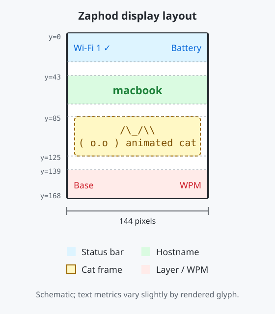

# Zaphod keymap

Zaphod is a 34-key keyboard configuration for [ZMK v0.3](https://zmk.dev/).

## Firmware builds

GitHub Actions builds the keyboard and TrackPoint targets from [`build.yaml`](build.yaml).

Download the generated UF2 files from the `firmware` artifact attached to a
successful workflow run. The ZMK version is pinned in
[`config/west.yml`](config/west.yml).

To build the original Zaphod firmware locally with Docker:

```sh
./build-local.sh
```

The generated firmware is copied to `~/Downloads/zaphod-zmk.uf2`. The first
build downloads the ZMK toolchain and dependencies; later builds reuse the
cached workspace. Set `ZAPHOD_FIRMWARE_OUTPUT` to use a different destination.

To build the standalone XIAO nRF52840 TrackPoint bring-up image:

```sh
./build-trackpoint-test.sh
```

This produces `~/Downloads/xiao-trackpoint-test.uf2`. It has no keyboard or
mouse-key input: it accepts PS/2 movement on D4/D5, drives the TrackPoint reset
from D9, and exposes the pointer over both USB and Bluetooth. See
[`docs/trackpoint/xiao-wiring.md`](docs/trackpoint/xiao-wiring.md) before
applying power.

The optional `zaphod_trackpoint` shield combines the keyboard, Sharp display,
and TrackPoint while keeping the display on its existing SPI pins. GitHub
Actions publishes it as `zaphod-trackpoint`. It uses three unused adjacent
Holyiot edge pads for CLOCK, DATA, and RESET; see
[`docs/trackpoint/zaphod-integration.md`](docs/trackpoint/zaphod-integration.md)
for the exact wiring and bring-up sequence.

For a TrackPoint connected **in place of the Sharp display**, use the separate
`zaphod_trackpoint_display_replacement` shield:

```sh
./build-display-replacement.sh
./build-display-replacement.sh zaphod-trackpoint-display-replacement --diagnostic
```

This pipeline uses an isolated dependency cache and verifies a pinned PS/2
transport patch. See the [replacement firmware guide](docs/trackpoint/replacement-firmware.md)
for J1 wiring, artifacts, regression builds and hardware bring-up. The image
has passed software validation; Zaphod hardware testing remains outstanding.
Select only one TrackPoint shield.

## Display

The 144×168 display uses evenly distributed status, hostname, animation, and
layer-information rows.



| L   |     |     |     |     |      |     |     |     |     | R   |
| :-- | :-- | :-- | :-- | :-- | :--: | --: | --: | --: | --: | --: |
| K00 | K01 | K02 | K03 | K04 |      | K05 | K06 | K07 | K08 | K09 |
| K10 | K11 | K12 | K13 | K14 |      | K15 | K16 | K17 | K18 | K19 |
| K20 | K21 | K22 | K23 | K24 |      | K25 | K26 | K27 | K28 | K29 |
| -   | -   | -   | K30 | K31 |      | K32 | K33 | -   | -   | -   |

## Layers

### Base Layer
| L   |     |     |     |     |      |       |     |     |     | R   |
| :-- | :-- | :-- | :-- | :-- | :--: | --:   | --: | --: | --: | --: |
| `q` | `w` | `e` | `r` | `t` |      | `y`   | `u` | `i` | `o` | `p` |
| `a` | `s` | `d` | `f` | `g` |      | `h`   | `j` | `k` | `l` | `;` |
| `z` | `x` | `c` | `v` | `b` |      | `n`   | `m` | `,` | `.` | `/` |
| -   | -   | -   | L1  | ` ` |      | `↵` | L2  | -   | -   | -   |


### Base Layer Hold
| L     |     |     |       |      |      |      |       |     |     | R     |
| :--   | :-- | :-- | :--   | :--  | :--: | --:  | --:   | --: | --: | --:   |
|       |     |     |       |      |      |      |       |     |     |       |
|       |     |     |       | ctrl |      | ctrl |       |     |     |       |
| shift |     |     | super | alt  |      | alt  | super |     |     | shift |
| -     | -   | -   |       |      |      |      |       | -   | -   | -     |

### L1: Number Layer 

TODO: change `-` to `.`.

| L      |     |     |     |        |      |     |     |     |     | R   |
| :--    | :-- | :-- | :-- | :--    | :--: | --: | --: | --: | --: | --: |
| `PGUP` |     | ↑   |     | `HOME` |      | +   | 7   | 8   | 9   | *   |
| `PGDN` | ←   | ↓   | →   | `END`  |      | -   | 4   | 5   | 6   | 0   |
|`CAPLCK`|     |     |     |        |      | =   | 1   | 2   | 3   | /   |
| -      | -   | -   |     |        |      |     |     | -   | -   | -   |

### L2: Symbol Layer

TODO: to expand.

| L       |     |     |     |     |      |     |      |     |     | R       |
| :--     | :-- | :-- | :-- | :-- | :--: | --: | --:  | --: | --: | --:     |
| `` ` `` | `&` | `*` | `\|` | `~` |     |  😊 | `{↵}`| `[]`| `()`|         |
| `"`     | `$` | `%` | `^`  | `\` |     |`'a'`| `->` |`!=` |     |`<<'\n';`|
| `'`     | `!` | `@` | `#`  | `_` |     |     |      |`<<` | `>>`|         |
| -       | -   | -   |     |     |      |     |      | -   | -   | -       |

### L5: Bluetooth Layer
Hold ` ` and `↵` to activate.
Select which bluetooth device to connect.

The display shows the hostname assigned to the selected output. Bluetooth
profile names are configurable through `CONFIG_ZAPHOD_HOSTNAME_0` through
`CONFIG_ZAPHOD_HOSTNAME_4`; their defaults are shown below.

| L          |          |          |        |          |      |     |     |     |     | R   |
| :--------- | :------- | :------- | :----- | :------- | :--: | --: | --: | --: | --: | --: |
| B0         | B1       | B2       | B3     | B4       |      |     |     |     |     |     |
| `macbook`  | `iphone` | `android` | `PC`   | `TV-box` |      |     |     |     |     |     |
|            |          |          |        |          |      |     |     |     |     |     |
| -          | -        | -        |        |          |      |     |     | -   | -   | -   |


### L6: Function Key Layer

Hold `↵` and `L2` to activate.

| L   |     |     |     |     |      |     |     |     |     | R   |
| :-- | :-- | :-- | :-- | :-- | :--: | --: | --: | --: | --: | --: |
| F12 | F7  | F8  | F9  | PSCRN    |      |     |     |     |     |     |
| F11 | F4  | F5  | F6  | SLCK    |      |     |     |     |     |     |
| F10 | F1  | F2  | F3  | ⏯   |      |     |     |     |     |     |
| -   | -   | -   |     |     |      |     |     | -   | -   | -   |

## Combo Keys

|key1 |key2 | combo |
|:-- |:-- | --: |
|`j` | `f` | `ESC` |
|`k` | `l` | ⌫ |
|`s` | `d` | ↹ |
|`f` | `d` | `(` |
|`j` | `k` | `)`|
|`f` | `s` | `[`|
|`j` | `l` | `]`|
|`f` | `a` |`{` |
|`j` | `;` |`}` |
|`i` | `o` | `=`|
|`i` | `u` | `-`|

### Zaphod KeyMap Template
| L   |     |     |     |     |      |     |     |     |     | R   |
| :-- | :-- | :-- | :-- | :-- | :--: | --: | --: | --: | --: | --: |
|     |     |     |     |     |      |     |     |     |     |     |
|     |     |     |     |     |      |     |     |     |     |     |
|     |     |     |     |     |      |     |     |     |     |     |
| -   | -   | -   |     |     |      |     |     | -   | -   | -   |
